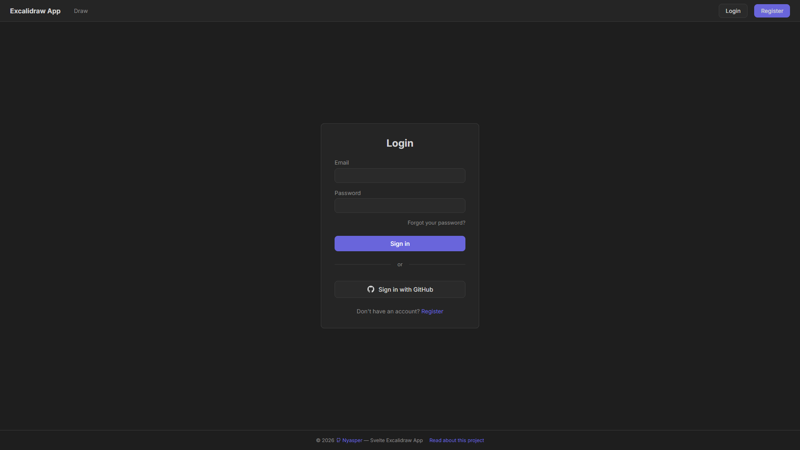
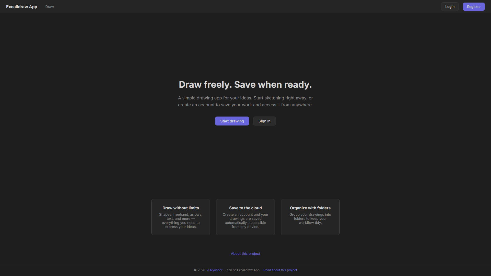
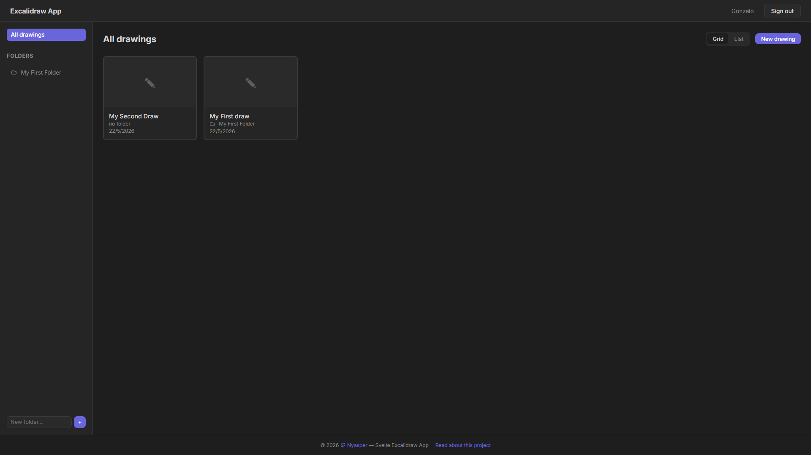
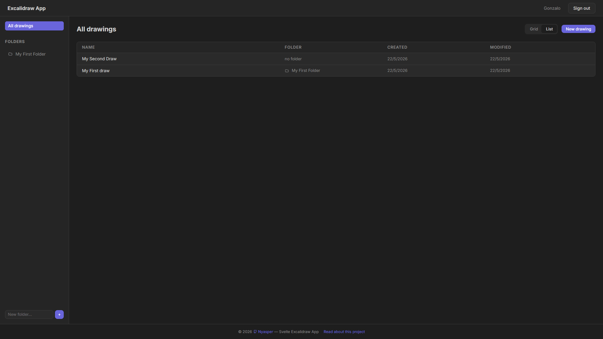
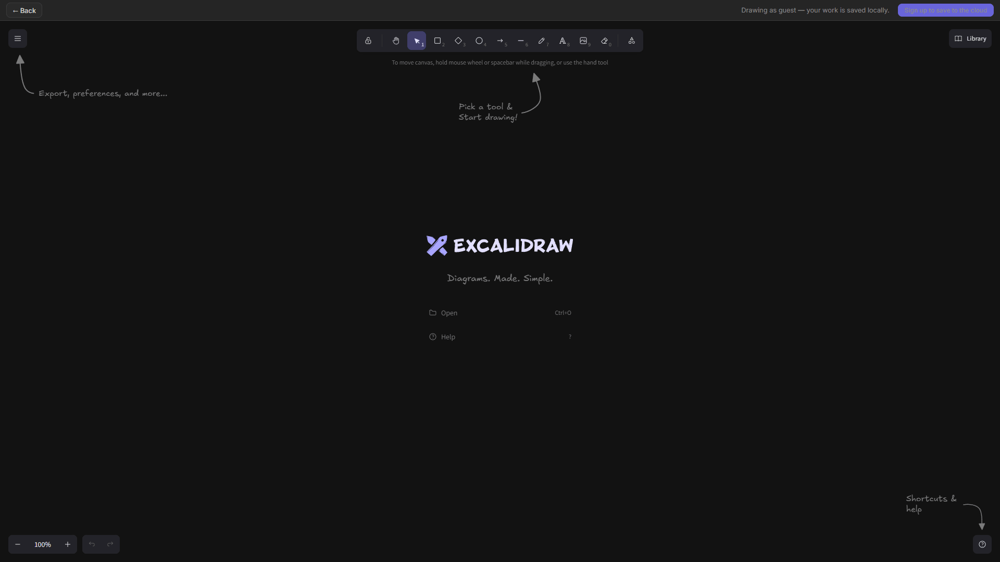

# Svelte Excalidraw App

A full-stack application that wraps the React-based [@excalidraw/excalidraw](https://github.com/excalidraw/excalidraw) component inside Svelte 5, with user authentication, persistent canvas storage, and folder organization.

---

## Why this project exists

### English

This project was created for three main reasons:

**1. My first project using agentic AI.**  
This is my first time building a real-world product end-to-end by myself, using agentic AI tools alongside all of my web development knowledge. The goal was to go beyond tutorials and side experiments — to ship something complete, with authentication, a database, email flows, and a polished UI. A production-grade application built from scratch.

**2. Svelte is the framework I know best.**  
I chose Svelte not because it's trendy, but because it's the framework I'm most comfortable with. I wanted to build something real and full-featured using the tools I understand deeply. Svelte 5's runes mode (`$state`, `$derived`, `$effect`), SvelteKit's file-based routing, and the clean separation between client and server make it an excellent choice for this kind of project.

**3. It is possible to use React libraries inside Svelte.**  
A technical bonus: this project demonstrates that it's entirely possible to embed a React component — even a complex one like Excalidraw — inside a Svelte application. By initializing the React component within a Svelte 5 `$effect()` (via the `@attach` directive), we bridge the two frameworks seamlessly. React becomes just another rendering target, while Svelte handles everything else.

The result? A working Excalidraw clone with auth, database persistence, and folder management — all powered by Svelte, with React living quietly inside a single component.

### Español

Este proyecto nació por tres razones principales:

**1. Mi primer proyecto usando IA agéntica.**  
Es la primera vez que construyo un producto real de principio a fin por mi cuenta, utilizando herramientas de IA agéntica junto con todo mi conocimiento en desarrollo web. El objetivo fue ir más allá de tutoriales y experimentos — lanzar algo completo, con autenticación, base de datos, flujos de correo y una interfaz pulida. Una aplicación de nivel producción construida desde cero.

**2. Svelte es el framework que más domino.**  
Elegí Svelte no porque esté de moda, sino porque es el framework con el que me siento más cómodo. Quería construir algo real y con todas sus funcionalidades usando las herramientas que entiendo a profundidad. El modo runes de Svelte 5 (`$state`, `$derived`, `$effect`), el routing basado en archivos de SvelteKit y la limpia separación entre cliente y servidor lo convierten en una excelente elección para este tipo de proyecto.

**3. Es posible usar librerías de React dentro de Svelte.**  
Un bonus técnico: este proyecto demuestra que es completamente factible embeber un componente de React — incluso uno tan complejo como Excalidraw — dentro de una aplicación Svelte. Inicializando el componente de React dentro de un `$effect()` de Svelte 5 (a través de la directiva `@attach`), logramos conectar ambos frameworks de forma transparente. React se convierte simplemente en otro destino de renderizado, mientras que Svelte se encarga de todo lo demás.

El resultado: un clon funcional de Excalidraw con autenticación, persistencia en base de datos y organización por carpetas — todo impulsado por Svelte, con React viviendo tranquilamente dentro de un solo componente.

---

## Screenshots

### Login


### Home


### Dashboard - Grid View


### Dashboard - List View


### Canvas Editor


---

## Tech Stack

| Layer                | Technology                                             |
| -------------------- | ------------------------------------------------------ |
| Frontend             | Svelte 5 (runes mode)                                  |
| Full-stack framework | SvelteKit                                              |
| Backend              | SvelteKit server actions + load functions              |
| Auth                 | Better Auth (email/password + GitHub OAuth)            |
| Email                | Resend (verification, password reset)                  |
| ORM                  | Drizzle ORM                                            |
| Database             | PostgreSQL 18                                          |
| DB Runtime           | Docker Compose (local development)                     |
| React component      | `@excalidraw/excalidraw`                               |
| React bridge         | `react` + `react-dom` (initialized inside `$effect()`) |
| Language             | TypeScript (strict mode)                               |
| Package manager      | Bun                                                    |
| Linting/Formatting   | ESLint + Prettier                                      |

## Architecture

```
src/
  lib/
    server/
      auth.ts           # Better Auth config (Drizzle adapter, email verification, password reset)
      email.ts          # Resend SDK wrapper for transactional emails
      db/
        index.ts        # Drizzle ORM + postgres.js connection
        schema.ts       # App tables (drawing, folder) + auth tables
        auth.schema.ts  # Auth tables (generated by `bun run auth:schema`)
        queries.ts      # Reusable CRUD queries
    components/
      Excalidraw.svelte # Core component: wraps React Excalidraw in $effect()
      Nav.svelte        # Top navigation bar (auth-aware)
      Dashboard.svelte  # Folder sidebar + drawing grid with drag-to-select
  routes/
    +layout.svelte      # Root layout with conditional Nav
    +page.svelte        # Home: landing page (guest) or Dashboard (authenticated)
    about/              # Project explanation (EN/ES)
    login/              # Email + GitHub OAuth with forgot password link
    register/           # Registration with password confirmation
    forgot-password/    # Request password reset (via Resend)
    reset-password/     # Set new password (token from email)
    draw/               # Canvas editor with auto-save
    draw/[id]/          # Canvas for existing drawings
    folders/            # Folder CRUD API
```

## Getting Started

### Prerequisites

- [Bun](https://bun.sh/) installed
- [Docker](https://www.docker.com/) (for local PostgreSQL)

### 1. Install dependencies

```sh
bun install
```

### 2. Set up environment variables

```sh
cp .env.example .env
```

Fill in the required values in `.env`:

| Variable               | Required | Description                            |
| ---------------------- | -------- | -------------------------------------- |
| `DATABASE_URL`         | Yes      | PostgreSQL connection string           |
| `ORIGIN`               | Yes      | App URL (e.g. `http://localhost:5173`) |
| `BETTER_AUTH_SECRET`   | Yes      | Random string for session signing      |
| `RESEND_API_KEY`       | Yes      | Resend API key for email sending       |
| `GITHUB_CLIENT_ID`     | No       | GitHub OAuth client ID                 |
| `GITHUB_CLIENT_SECRET` | No       | GitHub OAuth client secret             |

### 3. Start the database

```sh
bun run db:start
```

### 4. Push the database schema

```sh
bun run db:push
```

### 5. Generate auth schema (first time only)

```sh
bun run auth:schema
```

Then push again to create auth tables:

```sh
bun run db:push
```

### 6. Start the dev server

```sh
bun run dev
```

Open [http://localhost:5173](http://localhost:5173) in your browser.

## Available Scripts

| Command               | Description                                     |
| --------------------- | ----------------------------------------------- |
| `bun run dev`         | Start Vite dev server (port 5173)               |
| `bun run build`       | Production build                                |
| `bun run preview`     | Preview production build                        |
| `bun run check`       | Type-check (`svelte-kit sync` + `svelte-check`) |
| `bun run lint`        | Lint + format check                             |
| `bun run format`      | Auto-format with Prettier                       |
| `bun run db:start`    | Start PostgreSQL via Docker Compose             |
| `bun run db:push`     | Push Drizzle schema directly to DB              |
| `bun run db:generate` | Generate Drizzle migration files                |
| `bun run db:migrate`  | Apply Drizzle migrations                        |
| `bun run db:studio`   | Open Drizzle Studio                             |
| `bun run auth:schema` | Generate Better Auth schema tables              |

## How the React ↔ Svelte Bridge Works

The magic happens in `src/lib/components/Excalidraw.svelte`:

1. A `div` element is marked with `{@attach excalidraw}`, which runs a function when the element mounts.
2. Inside that function, `createRoot()` from `react-dom/client` creates a React root on that `div`.
3. `@excalidraw/excalidraw` is dynamically imported and rendered via `createElement()`.
4. When the Svelte component unmounts, `root.unmount()` cleans up the React tree.
5. The Excalidraw API reference is exposed as Svelte `$state` so the parent component can interact with it.

This means React is only active inside that single component's lifecycle. The rest of the app is pure Svelte.

## License

MIT
